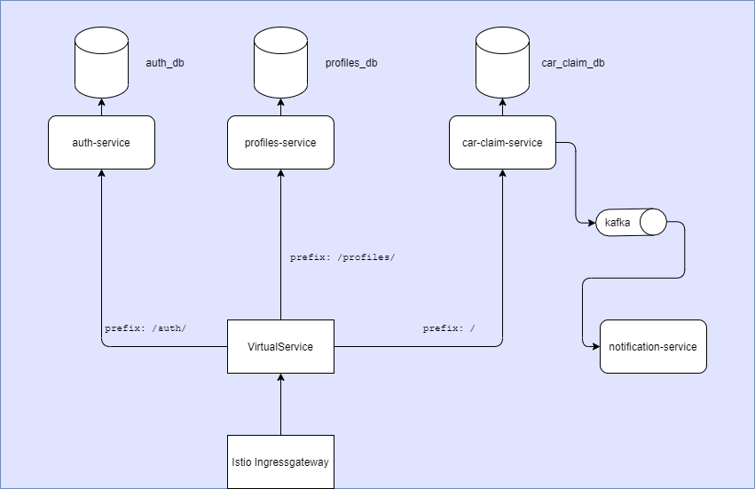

# Сервис для Автомобильной СТО
## kotlin-auto-service
Учебный проект курса [Otus](https://otus.ru) [Kotlin-2022-12](https://otus.ru/lessons/kotlin/)

## Описание проекта и основные функции
Сервис позволяет клиентам записываться на обслуживание автомобиля на определенную дату,
выбирать услугу, получать предварительный заказ-наряд и уведомления, получать рекомендации.
Сервис позволяет работникам автосервиса получать расписание запланированных работ.

- Авторизация (ролевая модель)
- Регистрация пользователей, редактирование профиля (добавление автомобиля).
- Выбор даты и времени для записи на обслуживание, выбор услуги
- Уведомление клиентов
- Уведомление работников сервиса о заявке на обслуживание, получение расписания
- Редактирование заявки (добавление позиций по запчастям и т.д.)
- Формирование предварительного заказ-наряда по типу услуги
- Автоматические рекомендации по обслуживанию в зависимости от пробега

## Целевая аудитория

- автосервисы, желающие автоматизировать процесс взаимодействия с клиентом,
планировать работы и управлять загрузкой автостанции.
- владельцы личных автомобилей (Лица страше 18 лет, имеющие в пользовании автомобиль)

## Сущности

1. User. Пользователь системы. Используется для аутентификации и авторизации
- id (UUID) Идентификатор
- email (String) Адрес e-mail
- createdDate (OffsetDateTime) Дата создания пользователя
- login (String) Логин пользователя
- password (String) Пароль пользователя (хранится в БД в хэшированном виде)
- role (enum) Роль пользователя (Администратор, Менеджер, Исполнитель, Клиент)

2. ServiceManProfile. Исполнитель работ
- id (UUID) Идентификатор
- fullName (String) Полное имя
- activeClaims (array, Claim) Список заявок в работе
- phoneNumber (String) Номер телефона
- userId (UUID) Идентификатор пользователя

3. ClientProfile. Клиент
- id (UUID) Идентификатор
- fullName (String) Полное имя
- age (Integer) Возраст
- carsList (array, Car) Список авто
- phoneNumber (String) Номер телефона
- claimList (array, Claim) Список заявок
- userId (UUID) Идентификатор пользователя

3. Car. Автомобиль
- id (UUID) Идентификатор
- brand (enum) Марка автомобиля
- model (String) Модель Автомобиля
- vin (String) VIN-номер
- manufactureYear (Integer) Год производства
- gosNumber (String) Гос.номер
- profileId (UUID) Идентификатор клиента
- mileage (Long) Пробег

4. Claim. Заявка на проведение работ
- id (UUID) Идентификатор
- profileId (UUID) Идентификатор клиента
- carId (UUID) Идентификатор авто
- operationList (array, enum) Наименование заявленных работ
- time (double) Примерное время выполнения работ
- serviceSlots (array, ServiceSlot) Время, выделенное под выполнение работ
- status (enum) Статус заявки
- serviceMan (UUID) Идентификатор исполнителя работ
- createdDate (OffsetDateTime) Дата создания заявки
- updatedDate (OffsetDateTime) Дата изменения заявки

5. ServiceSlot. Время, выделенное под выполнение работ
- id (UUID) Идентификатор
- serviceMan (UUID) Идентификатор исполнителя работ
- timeSlot (enum) Временной промежуток, на который назначено выполнение работ
- serviceDate (LocalDate) Дата, на которую назначено выполнение работ

## Архитектурное видение приложения 

Приложение имеет микросервисную архитектуру.

Микросервисы:
- Сервис Аутентификации и Авторизации
- Сервис Управления Профилем
- Сервис Автомобилей и Заявок 
- Сервис Уведомлений

Деплой: kubernetes при помощи Helm, применение Istio для настройки авторизации в mesh.
  
Связь микросервисов: REST HTTP, Kafka. 

Базы данных: PostgreSQL

### [DockerFile](hw02-doc%2Fdeploy%2Fdockerfile)
Для сборки docker-образа:

    `docker build -t gurok/hw02 ./hw02-doc/`
    `docker run -d -p 8080:8080 gurok/hw02`

### [Интеграционный тест](hw02-doc%2Fsrc%2Ftest%2Fkotlin%2Fru%2Fgur%2FApplicationTest.kt)
